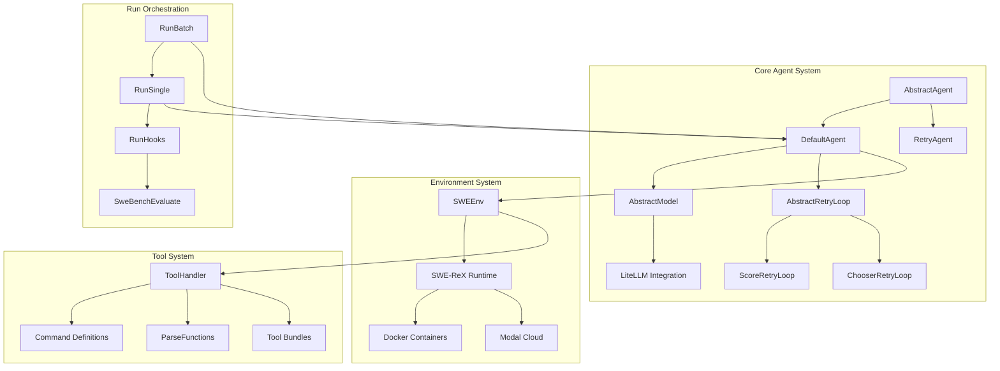
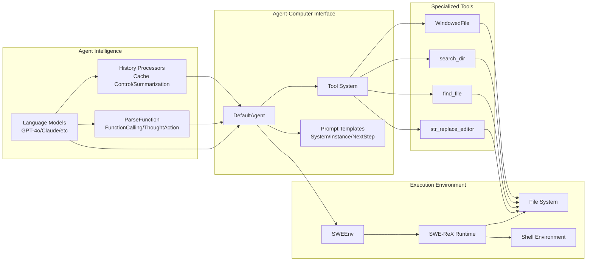
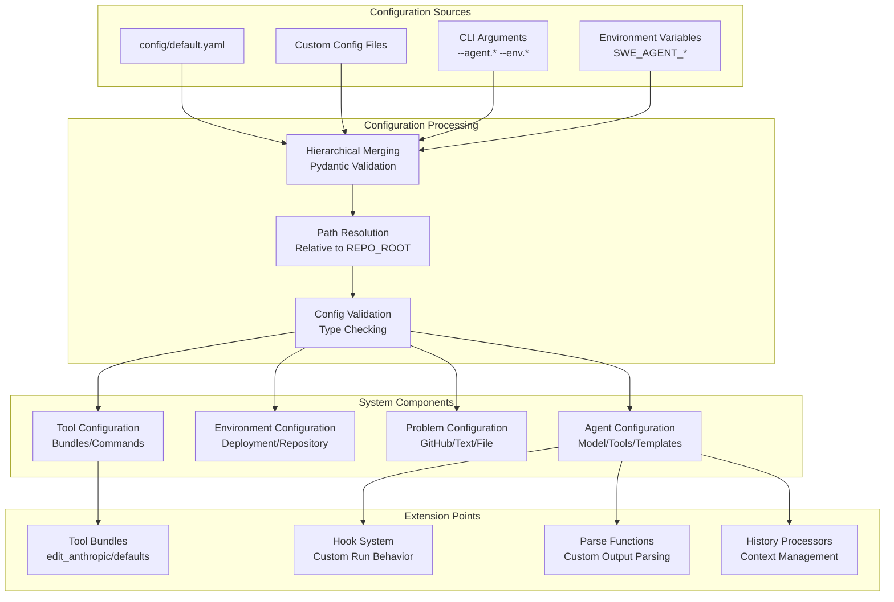
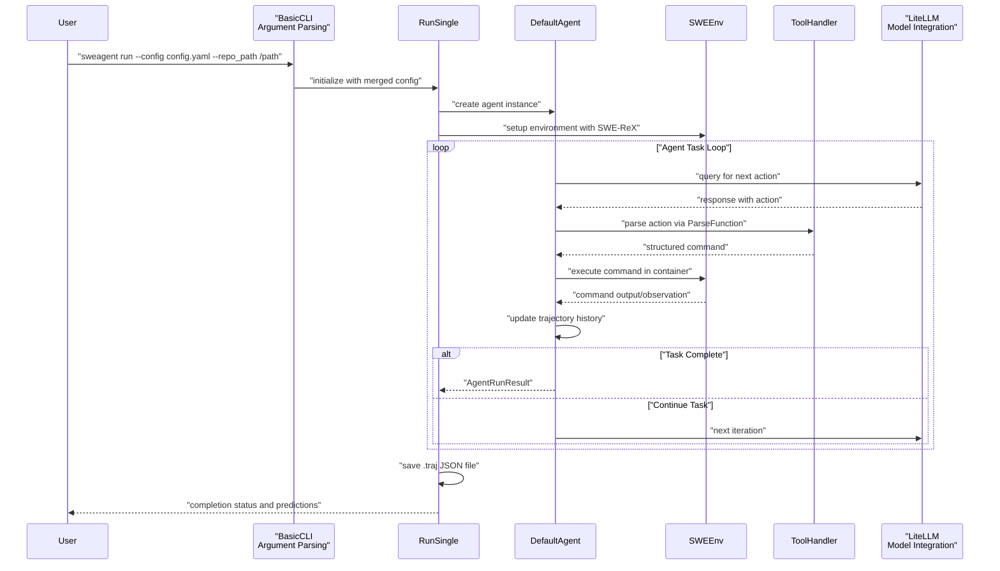
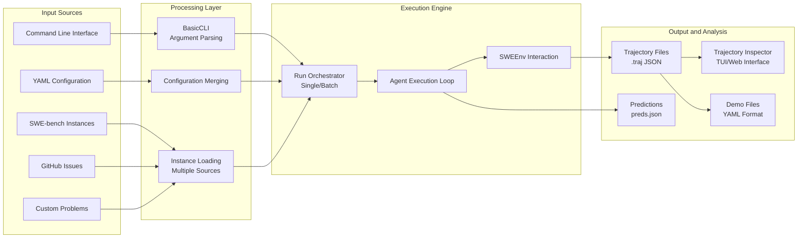
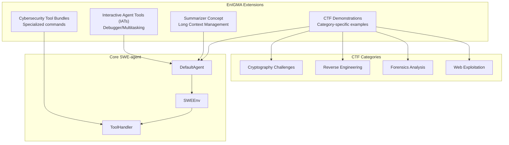
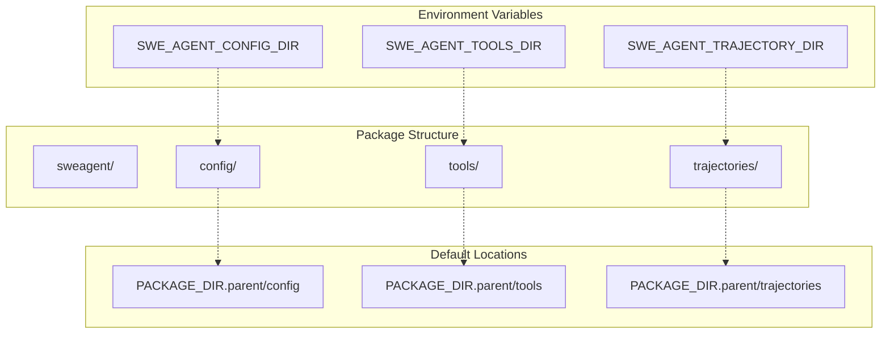

# Page: Overview

# Overview

<details>
<summary>Relevant source files</summary>

The following files were used as context for generating this wiki page:

- [README.md](README.md)
- [docs/background/index.md](docs/background/index.md)
- [docs/index.md](docs/index.md)
- [docs/overrides/main.html](docs/overrides/main.html)

</details>


## Purpose and Scope

SWE-agent is an AI software engineering agent that enables language models (e.g., GPT-4o, Claude Sonnet) to autonomously fix issues in real GitHub repositories, find cybersecurity vulnerabilities, and perform custom software engineering tasks. The system achieves state-of-the-art performance on SWE-bench by implementing an **Agent-Computer Interface (ACI)** that provides LM-centric commands and feedback formats.

Key capabilities include:
- ✅ **State of the art** on SWE-bench among open-source projects
- ✅ **Free-flowing & generalizable**: Leaves maximal agency to the LM
- ✅ **Configurable & fully documented**: Governed by a single `yaml` file
- ✅ **Made for research**: Simple & hackable by design

### EnIGMA Cybersecurity Extension

SWE-agent includes **EnIGMA** (Enhanced Interactive Generative Model Agent), a specialized mode for offensive cybersecurity challenges. EnIGMA achieves state-of-the-art results on multiple cybersecurity benchmarks, solving 13.5% of challenges on the NYU CTF benchmark and surpassing previous agents by more than 3x.

For detailed information about specific subsystems, see:
- Core agent logic and model integration: [Agent Framework](#3)
- Code execution environments and containerization: [Environment System](#4) 
- Single instance and batch processing workflows: [Execution and Run System](#5)
- File editing, search, and command parsing: [Tool System](#6)
- Command line interface and configuration: [Command Line Interface](#7)
- Trajectory analysis and debugging tools: [Trajectory Management and Inspection](#8)

Sources: [README.md:14-24](), [docs/index.md:16-26](), [docs/background/index.md:7-14](), [docs/background/index.md:41-44]()

## System Architecture Overview

SWE-agent follows a modular architecture that separates concerns between orchestration, agent execution, model integration, environment management, and tool operations.

### Core System Architecture



Sources: [README.md:1-130](), [docs/background/index.md:1-70]()

### Agent-Computer Interface (ACI) Flow



Sources: [docs/background/index.md:11-12](), [docs/background/index.md:45-46]()

### Configuration and Data Flow

SWE-agent uses a hierarchical configuration system built on Pydantic models that manages everything from agent behavior to environment setup.



Sources: [README.md:21](), [docs/index.md:23]()

## Key System Components

### Agent Execution Pipeline

The agent execution follows a structured pipeline from initialization through task completion, with comprehensive error handling and retry mechanisms.



Sources: [README.md:14-24](), [docs/background/index.md:7-14]()

### Data Flow and Processing Pipeline



Sources: [README.md:15-17](), [docs/background/index.md:41-49]()

### EnIGMA Cybersecurity Capabilities

EnIGMA extends SWE-agent with specialized cybersecurity features for offensive security challenges.



Sources: [README.md:47-55](), [docs/background/index.md:36-50]()

### Version and Dependency Management

SWE-agent maintains strict version compatibility with its dependencies, particularly SWE-ReX for runtime execution.

| Component | Version | Requirement |
|-----------|---------|-------------|
| SWE-agent | 1.1.0 | Current version |
| Python | >= 3.11 | Minimum supported |
| SWE-ReX | >= 1.2.0 | Minimum required |
| SWE-ReX | 1.2.1 | Recommended |

The system includes version checking and warnings for compatibility:

```python
# Version validation constants
PYTHON_MINIMUM_VERSION = (3, 11)
SWEREX_MINIMUM_VERSION = "1.2.0"
SWEREX_RECOMMENDED_VERSION = "1.2.1"
```

Sources: [sweagent/__init__.py:15-18](), [sweagent/__init__.py:85-104]()

### Directory Structure and Package Organization

SWE-agent organizes its components across several key directories that can be configured via environment variables:



Sources: [sweagent/__init__.py:28-47]()

## Integration with External Systems

### SWE-ReX Runtime Integration

SWE-agent relies heavily on SWE-ReX for secure, isolated code execution. The integration includes version compatibility checking and commit hash tracking for reproducibility.

```python
# Version and commit tracking functions
def get_rex_version() -> str
def get_rex_commit_hash() -> str
def impose_rex_lower_bound() -> None
```

### Model Provider Support

SWE-agent supports multiple LLM providers through a unified interface, including OpenAI, Anthropic, and local model deployments. The system uses LiteLLM for provider abstraction and includes cost tracking and retry mechanisms.

### Documentation and Development Infrastructure

The project uses MkDocs for documentation generation with automatic API reference generation via mkdocstrings. The development workflow includes pre-commit hooks, GitHub Actions CI/CD, and comprehensive testing infrastructure.

Sources: [sweagent/__init__.py:62-82](), [mkdocs.yml:118-150](), [docs/installation/changelog.md:1-343]()